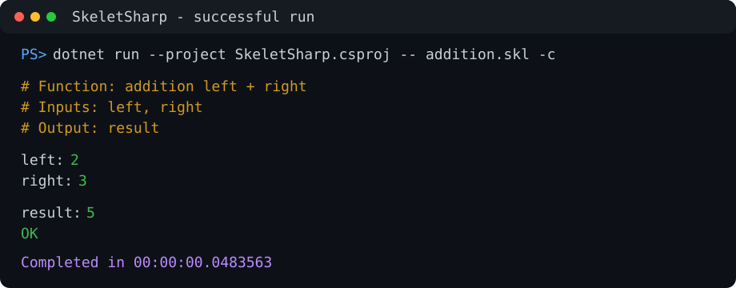
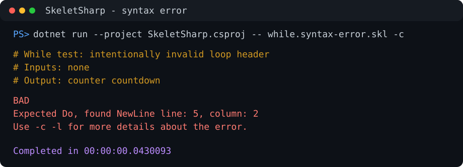

# 🧮 SkeletSharp Interpreter

> Educational interpreter for a minimal skeleton/while language. The project turns a tiny set of primitive commands into a working console interpreter, making it possible to observe how arithmetic, comparison, and control flow can emerge from almost nothing: variable increment, variable decrement, and `while x <> 0 do ... end` loops.

# 🎯 Overview

SkeletSharp is a small interpreter for a deliberately minimal programming language inspired by computability theory.

The language is built around a tiny instruction set:

* increment a variable
* decrement a variable
* repeat a block while a variable is non-zero
* read input values
* write output values

At first glance, such a language looks almost too small to be useful. That is exactly the point of the project.

In theoretical computer science, very small formal languages are often used to study what can be computed, independently of the conveniences provided by real-world programming languages. A `while` language over natural numbers is a classic model of computation. With unbounded variables and unbounded execution time, it can express the same class of computable functions as other universal computation models such as Turing machines.

This project demonstrates that idea in a practical and inspectable way:

* there are no arithmetic operators in the core language
* addition is built from repeated `incr`
* subtraction is built from repeated `decr`
* multiplication is built from repeated addition
* factorial, exponentiation, integer division, modulo, and comparisons are composed from the same basic operations

The goal is not to create a production programming language. The goal is to make the mechanics of computation visible.

# 📚 Source Material

The project is based on the skeleton programming language described in the Czech university study text:

> Viktor Pavliska, *Vyčíslitelnost a složitost 2*, Ostrava University, 2004.

The most relevant part is chapter [4.1 Skeletový programovací jazyk](https://web.osu.cz/~Habiballa/opory/xvys2.pdf#page=57), followed by sections on partial recursive functions and functions programmable in the skeleton language.

# 🧠 Language Model

## Core Instructions

The core language supports:

```text
input variable
output variable
incr variable
decr variable

while variable <> 0 do
  ...
end
```

Variables store non-negative integer values.

If a variable is used before it is explicitly assigned or read from input, the interpreter creates it automatically with a random initial value. This behavior is useful for demonstrating the formal skeleton language style, but it is also one of the current implementation limitations.

## Comments

Comment lines start with `#`:

```text
# this is a comment
```

The `-c` command line option can display comments during interpretation.

# ⚙️ Preprocessor

SkeletSharp also includes a simple preprocessor that expands a small amount of syntactic sugar into the core language.

## `clear`

```text
clear result
```

is expanded to:

```text
while result <> 0 do
  decr result
end
```

## Assignment

```text
target = source
```

is expanded into core instructions that copy the value from `source` to `target` while preserving the value of `source`.

The generated code uses internal helper variables such as `auxAssign1`, `auxAssign2`, and so on. These names are generated to avoid collisions with identifiers already present in the user program. This matters because a fixed helper name, such as `aux`, could overwrite a user variable and silently change program behavior.

# ✨ Example

The following program computes `left + right`:

```text
# Function: addition left + right
# Inputs: left, right
# Output: result

input left
input right

result = left
plusTempRight = right

while plusTempRight <> 0 do
  incr result
  decr plusTempRight
end

output result
```

Although the program uses assignment, the interpreter ultimately executes only the core operations after preprocessing.

# 🧩 Demo Programs

The `demo/` directory contains runnable `.skl` programs demonstrating how higher-level operations can be composed from the minimal instruction set.

| File | Demonstrates |
| --- | --- |
| `demo/addition.skl` | addition |
| `demo/monus.skl` | monus / saturated subtraction |
| `demo/multiplication.skl` | multiplication |
| `demo/equality.skl` | equality comparison |
| `demo/less_than.skl` | less-than comparison |
| `demo/less_or_equal.skl` | less-or-equal comparison |
| `demo/is_zero.skl` | zero test |
| `demo/exponentiation.skl` | exponentiation |
| `demo/factorial.skl` | factorial |
| `demo/integer_division.skl` | integer division |
| `demo/modulo.skl` | modulo |

Additional while-loop experiments are stored in:

```text
demo/while-tests/
```

Reusable code snippets intended for manual insertion are stored in:

```text
demo/modules/
```

There is currently no `include` mechanism, so modules are examples of reusable blocks rather than independently imported source files.

# 🗂️ Project Structure

```text
/
|-- Interpreter.cs                 # Executes preprocessed skeleton source code
|-- Lexer.cs                       # Converts source text into tokens
|-- Preprocessor.cs                # Expands clear and assignment into core code
|-- RuntimeValue.cs                # Runtime value representation
|-- SourcePosition.cs              # Source location tracking
|-- SkeletonException.cs           # Custom syntax/runtime exceptions
|-- Token.cs                       # Token definitions
|-- WhileLoopContext.cs            # Runtime while-loop state
|-- Program.cs                     # Console application entry point
|
|-- demo/                          # Runnable demonstration programs
|   |-- addition.skl
|   |-- multiplication.skl
|   |-- factorial.skl
|   |-- ...
|   |-- modules/                   # Reusable snippets for manual insertion
|   `-- while-tests/               # Focused while-loop behavior experiments
|
|-- SkeletSharp.Tests/             # xUnit test project
|   |-- PreprocessorTests.cs
|   |-- LexerTests.cs
|   |-- RuntimeValueTests.cs
|   `-- InterpreterTests.cs
|
|-- SkeletSharp.csproj
`-- SkeletSharp.sln
```

# 🔧 Requirements

* .NET 10 SDK
* Windows, Linux, or macOS supported by the .NET SDK
* Visual Studio 2026 or another editor with .NET support

The project has no runtime NuGet dependencies.

The test project uses:

* `xunit`
* `Microsoft.NET.Test.Sdk`
* `xunit.runner.visualstudio`
* `coverlet.collector`

# 🏗️ Build

From the repository root:

```powershell
dotnet restore
dotnet build SkeletSharp.sln
```

# 🚀 Running

Run a demo program:

```powershell
dotnet run --project SkeletSharp.csproj -- demo/addition.skl
```

Example input:

```text
left: 2
right: 3
```

Expected output:

```text
result: 5
OK
```

## Command Line Options

```text
Usage: SkeletSharp filename.skl [-c] [-d] [-l]
```

Options:

| Option | Meaning |
| --- | --- |
| `-c` | display comment lines during execution |
| `-l` | display preprocessed source code before execution |
| `-d` | display all variables after execution |

## Console Examples

Successful run with comments enabled:



Syntax error detection using an intentionally invalid example:



# 🧪 Testing

Run all tests:

```powershell
dotnet test SkeletSharp.sln
```

The test suite currently covers:

* preprocessor expansion
* lexer tokenization
* runtime value comparison
* interpreter execution
* console I/O behavior
* readable syntax and runtime exceptions
* generated assignment helpers avoiding user-variable collisions

# ⚠️ Current Limitations

Known limitations:

* The theoretical model assumes unbounded natural numbers, while this implementation uses `UInt32`.
* Variables used before explicit initialization receive random values, which is useful for demonstration but not ideal for deterministic programming.
* The interpreter currently reads from and writes to `Console` directly.
* There is no parser or AST layer; execution works directly over the token stream.
* There is no `include` mechanism for module files.
* Error messages are in English, while code comments are currently Czech.
* Demo programs are educational and optimized for readability rather than performance.

# Status

Current status:

* ✅ modernized to `.NET 10`
* ✅ SDK-style project file
* ✅ xUnit test project included
* ✅ core interpreter implemented
* ✅ preprocessor implemented for `clear` and assignment
* ✅ demo programs added for arithmetic, comparison, factorial, modulo, and loop behavior
* ✅ custom syntax/runtime exceptions with line and column information

# License

Educational project intended for study and demonstration purposes.
